# Healthcare Risk Analytics Dashboard

## Project Overview

This project is an end-to-end Healthcare Risk Analytics Dashboard developed using Python, Pandas, NumPy, Matplotlib, SQL, MySQL, Excel, and Power BI.

The project analyzes healthcare patient data to identify:
- High-risk patients
- Medical condition trends
- Billing insights
- Admission patterns
- Insurance provider analysis

---

# Technologies Used

- Python
- Pandas
- NumPy
- Matplotlib
- SQL
- MySQL
- Microsoft Excel
- Power BI

---

# Project Workflow

```text
Healthcare Dataset CSV
        ↓
Python Data Cleaning & Analysis
        ↓
Feature Engineering & Risk Analysis
        ↓
MySQL Database Integration
        ↓
SQL Query Analysis
        ↓
Power BI Interactive Dashboard
```

---

# Python Analysis

Performed:
- Data Cleaning
- Exploratory Data Analysis (EDA)
- Risk Score Calculation
- Advanced Risk Classification
- Monthly Admission Analysis
- Data Visualization using Matplotlib

---

# SQL Analysis

Implemented SQL queries for:
- Total Patients
- Gender Distribution
- Medical Condition Analysis
- Average Billing Analysis
- Admission Type Analysis

---

# Power BI Dashboard Features

Dashboard includes:
- KPI Cards
- High Risk Patient Analysis
- Medical Condition Distribution
- Monthly Admission Trends
- Insurance Provider Analysis
- Interactive Filters & Slicers

---

# Power BI Dashboard

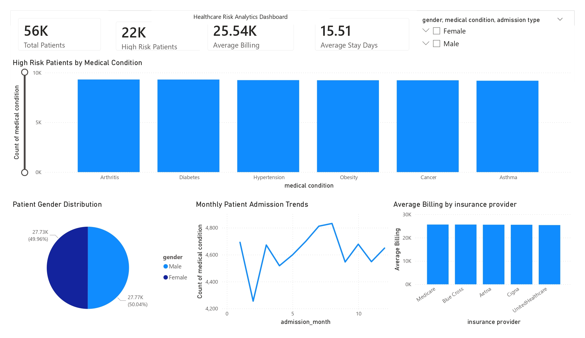

---

# Python Visualizations

## Age Distribution
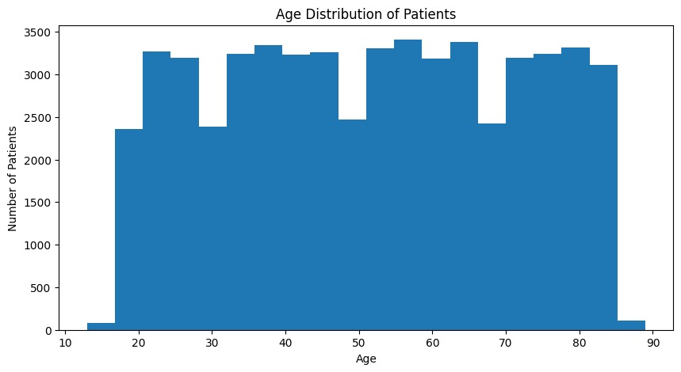

## Gender Distribution
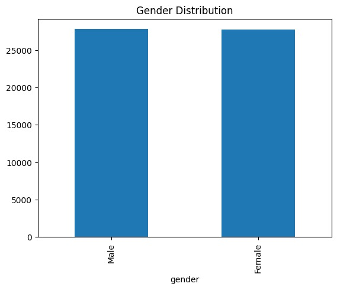

## Medical Conditions
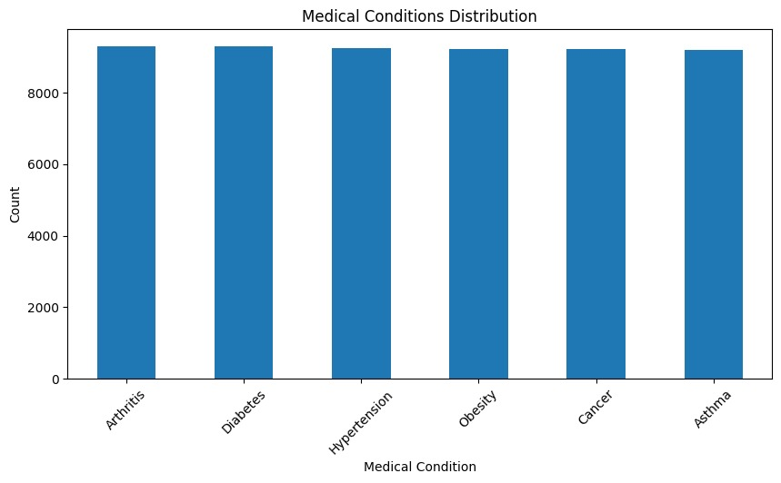

## Monthly Admissions
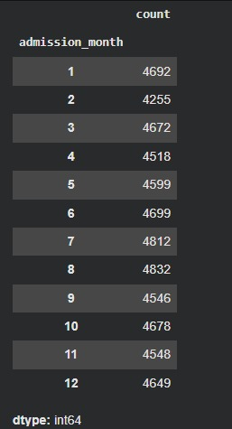

## Risk Level Distribution
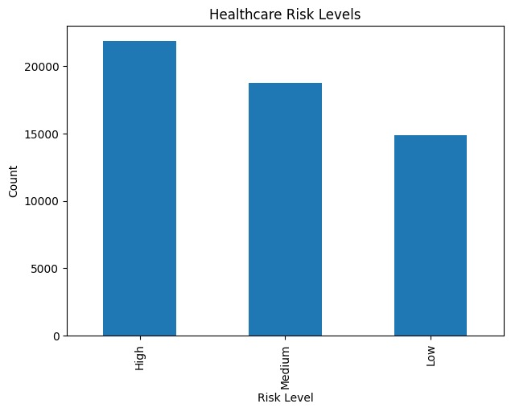

## Advanced Risk Pie Chart
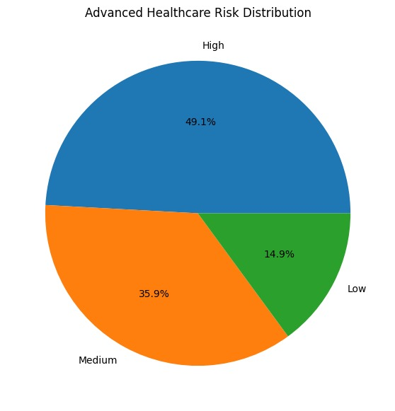

---

# SQL Query Results

## Total Patients
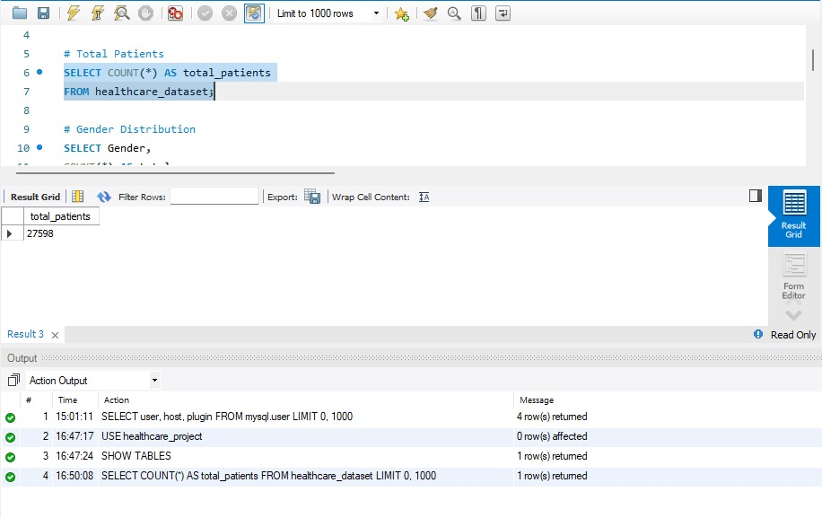

## Gender Distribution
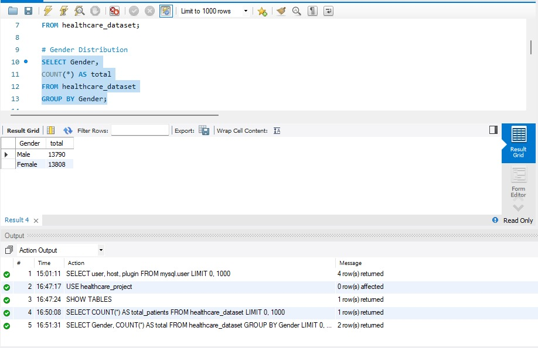

## Medical Conditions
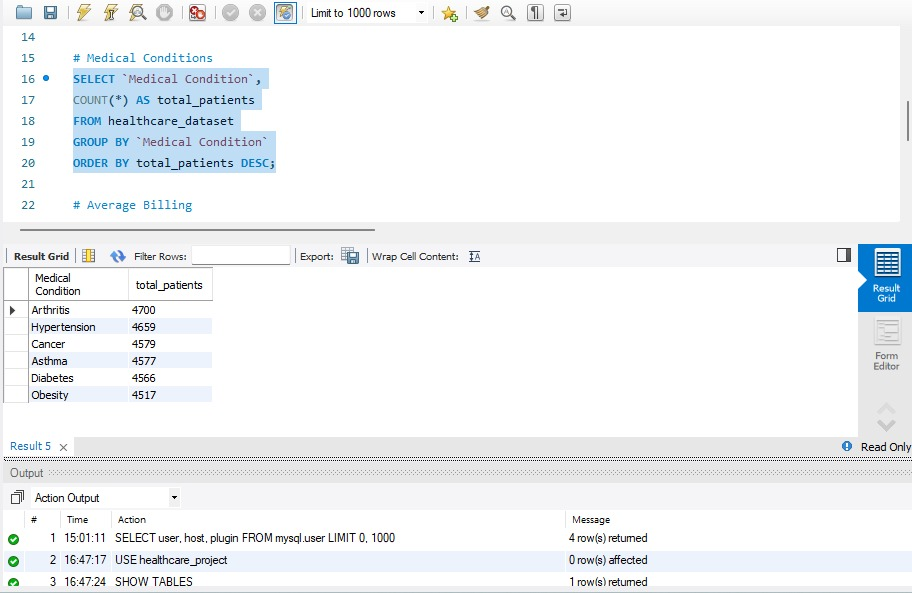

## Admission Types
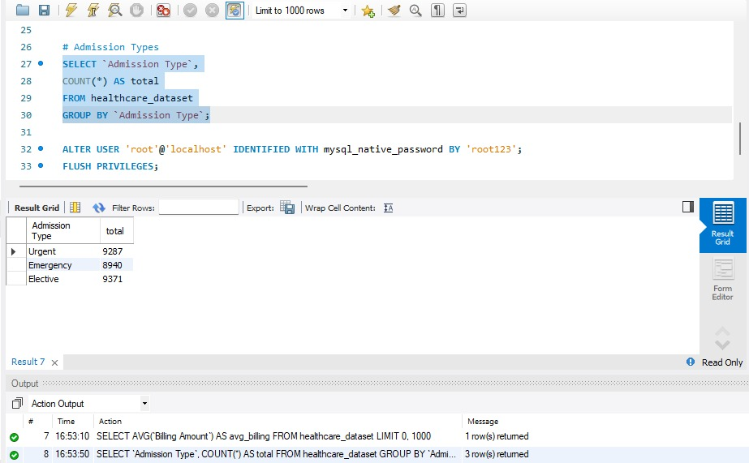

## Average Billing
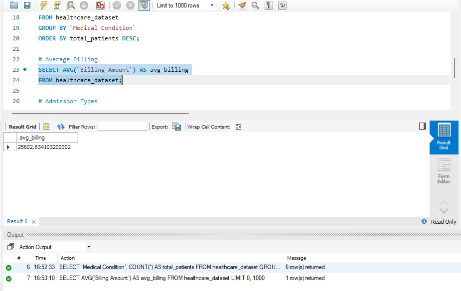

---

# Project Files

- `CivicPulse_Analytics.ipynb`
- `Project.pbix`
- `healthcare_dataset.csv`
- `civicpulse_final_healthcare_analysis.csv`

---

# Author

Naveenbalaji R
